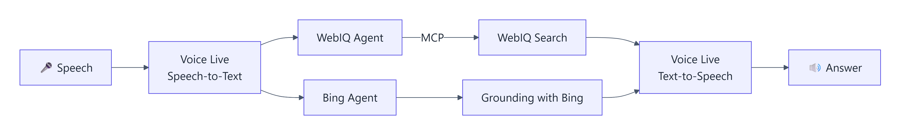
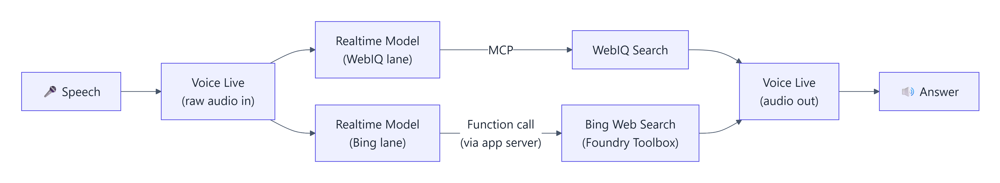

# TMAP 음성 검색 비교 · WebIQ vs Grounding with Bing

TMAP 차량 음성 에이전트에 붙일 웹 검색을 고르기 위한 데모다. 질문 한 번(텍스트 또는 음성)을
**WebIQ와 Grounding with Bing에 동시에** 보내고, 에이전트가 어떻게 생각·검색해서 답했는지 나란히 보여 준다.
Azure Voice Live와 Microsoft Foundry Agent를 사용한다.

> 비공개 저장소다. 키·토큰·구독 같은 환경 값은 코드와 결과 파일에 넣지 않고 `.env`로만 설정한다.
> 검색·모델·음성 호출은 실제 사용량이 발생하며, 한 질문에 두 엔진 비용이 함께 든다.

## 두 가지 모드

**① Agent 연결 (기본, 공정 비교용)** — 같은 모델·같은 지시로 만든 두 Foundry Agent가 같은 질문 글자를 받고,
검색 도구만 다르다.



**② End-to-end** — Agent 없이 Realtime 음성 모델이 음성을 직접 듣고 검색 도구를 직접 부른다.
WebIQ는 MCP로, Bing은 Foundry Toolbox의 Bing 기반 Web Search를 앱 서버가 대신 호출한다.



| | Agent 연결 | End-to-end |
| --- | --- | --- |
| 생각하는 쪽 | Foundry Agent | Realtime 음성 모델 (`gpt-realtime-mini` / `gpt-realtime`) |
| 질문 전달 | STT 글자 (두 엔진 동일) | 원본 음성 (엔진마다 따로 들음) |
| WebIQ | Agent → MCP | 모델 → MCP |
| Bing | Agent → Grounding with Bing | 모델 → 앱 서버 → Toolbox Web Search |
| 응답 시작 (관측) | 약 4–7초 | WebIQ 약 1초, Bing 약 10초 |
| 용도 | WebIQ vs Bing 공정 비교 | 속도, WebIQ가 음성 모델에 바로 붙는 점 |

화면은 엔진별로 **질문 → 생각 → 검색 → 찾은 결과 → 답변** 단계와 걸린 시간, 검색어·검색 결과·출처,
답변 텍스트와 음성을 보여 준다. 모드와 STT·TTS 옵션은 오른쪽 위 **설정**에서 바꾼다.
자세한 옵션과 서비스 제약은 [음성 설정](docs/VOICE_OPTIONS.md)에 있다.

## 로컬 실행

WSL Ubuntu에서 실행하고 Windows 브라우저로 접속한다. 프런트엔드 빌드는 없다.

```bash
cp config/runtime.example.env .env        # 값 채우기 (아래 설정 참고)
# Windows 마운트 아래 worktree면 가상환경을 마운트 밖에 둔다
export UV_PROJECT_ENVIRONMENT="$HOME/.cache/tmap-webiq-poc/$(basename "$PWD")-venv"
uv sync --frozen
uv run tmap serve --port 8000
```

http://localhost:8000 을 연다. 다른 포트를 쓰면 `TMAP_ALLOWED_ORIGINS`에 그 주소를 추가한다.
서버 시작만으로는 Azure를 호출하지 않으며, 말하기를 누를 때만 마이크를 요청한다.

## 설정

모든 값은 [`config/runtime.example.env`](config/runtime.example.env)에 설명과 함께 있다. 요약:

| 그룹 | 변수 |
| --- | --- |
| 인증 | `TMAP_AUTH_MODE` (`cli` / `managed_identity`), `TMAP_POC_AZ_SUBSCRIPTION`, `AZURE_CLIENT_ID` |
| Foundry 프로젝트·Agent | `GWB_PROJECT_ENDPOINT`, `TMAP_POC_MODEL_DEPLOYMENT`, `GWB_CONNECTION_ID`, `WEBIQ_CONNECTION_ID`, `TMAP_{BING,WEBIQ}_AGENT_{NAME,VERSION}` |
| Voice Live | `TMAP_VOICE_ENDPOINT`, `TMAP_VOICE_NAME`, `TMAP_VOICE_FOUNDRY_RESOURCE_OVERRIDE`, `TMAP_WEB_SEARCH_TOOLBOX` |
| 웹 앱·Trace | `TMAP_ALLOWED_ORIGINS`, `TMAP_TRACE_EXPORTER`, `APPLICATIONINSIGHTS_CONNECTION_STRING` |

처음 한 번 Agent를 준비한다. 첫 명령은 계획만 보여 주고, `--apply`가 실제 Agent 버전을 등록한다.

```bash
uv run python scripts/setup_webiq_connection.py   # WebIQ 키를 Foundry 프로젝트 연결로 저장 (WEBIQ_API_KEY)
uv run tmap prepare-agents
uv run tmap prepare-agents --apply                 # 출력된 이름·버전을 .env에 넣는다
```

End-to-end의 Bing 쪽은 `web_search` 도구를 담은 Foundry Toolbox가 필요하다. 만드는 방법은 [배포 안내](docs/DEPLOYMENT.md)에 있다.

## Azure 배포

FastAPI와 정적 화면이 Docker 이미지 하나에 들어가며 Azure Container Apps에 배포한다.
준비된 Container App에는 한 명령으로 이미지를 빌드·갱신한다(기본은 계획만 표시, `--apply`로 실행).

```bash
uv run python scripts/deploy_voice_app.py --subscription <SUB> --resource-group <RG> --registry <ACR> --name <APP> --apply
```

스크립트는 로그인이 꺼진 앱을 거부한다(짧은 공개 시연만 `--allow-anonymous`). 리소스·역할은 만들지 않는다.
최초 호스팅, 인증, 역할, 배포 후 확인은 [배포 안내](docs/DEPLOYMENT.md)를 따른다.

## 테스트

Azure를 호출하지 않는다.

```bash
uv run python -m unittest discover -s tests   # 서버
node --test tests/frontend.test.cjs           # 화면
python scripts/scan_secrets.py                # 커밋 전 비밀값 검사
```

## 저장소 구조

| 위치 | 내용 |
| --- | --- |
| `src/tmap_poc/api.py`, `cli.py` | 웹 API·WebSocket(`/ws/voice`), `tmap serve / prepare-agents / compare` |
| `src/tmap_poc/voice.py` | Voice Live 연결, 이벤트 중계, 검색 후속 답변 요청, End-to-end Bing `web_search` 실행 |
| `src/tmap_poc/voice_options.py` | 모드·STT·LLM·TTS 옵션 검증과 세션 구성 |
| `src/tmap_poc/webiq_mcp.py`, `web_search.py` | WebIQ MCP 대상 조회, Foundry Toolbox Web Search 호출 |
| `src/tmap_poc/profiles.py`, `arms.py` | 두 Agent의 공통 지시와 검색 도구 정의 |
| `src/tmap_poc/app_settings.py`, `auth.py`, `config.py` | 환경 설정, 구독 고정 CLI 인증·Managed Identity |
| `src/tmap_poc/telemetry.py`, `tool_spans.py`, `trace_view.py` | 메타데이터 trace, 도구 span, Foundry trace 조회 API |
| `src/tmap_poc/navigation*.py` | API 전용 앱 조작 데모(`model_tools`, 화면에서는 숨김) |
| `src/tmap_poc/static/` | 비교 화면 (`app.js` 연결·마이크, `compare-view.js` 단계·검색·답변 표시) |
| `scripts/` | 배포, WebIQ 연결 준비, 음성 연결 점검, 비밀값 검사 |
| `docs/`, `results/` | 문서와 근거 결과 |

## 문서

- [음성 설정과 서비스 제약](docs/VOICE_OPTIONS.md)
- [배포 안내](docs/DEPLOYMENT.md)
- [음성 연결 검증 기록](docs/VOICE_STATUS.md) — 날짜별 실제 실행 결과와 근거 JSON
- [Trace 설정](docs/TRACING.md)
- [텍스트 검색 벤치마크 V9 보고서](docs/REPORT.md) — 30질문 × Bing·WebIQ 기본·WebIQ 최적화 (2026-09-08)
